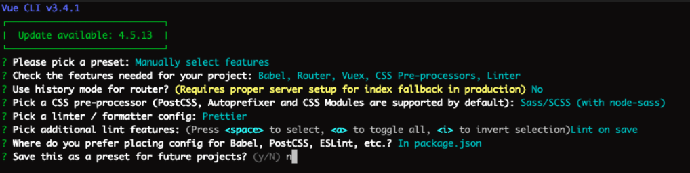
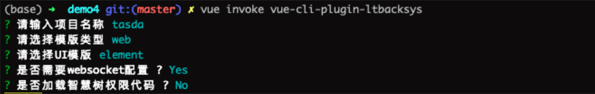

## [pc端自定义开发脚手架](git@github.com:gitofrenlu/demoCli.git)
适用场景：**新启动的项目或需要重构的项目，目前仅包括前端代码**
**特点：**
1. 提供了多个可选属性，包括模版类型，ui模版类型等
2. 集成了团队已有项目约定，包括统一eslint配置，通用api格式，内部智慧树权限代码逻辑等
3. 提供 **命令行** & **vue ui两种加载方式** 3分钟创建一个合格规范的后台系统
4. element版本标准的后台版本基于[vue-admin-template](https://github.com/PanJiaChen/vue-admin-template/blob/master/README-zh.md)模版开发

### 开始使用
1. 【强制】使用vue-cli 脚手架进行项目创建

```
> npm i -g @vue/cli@3.4.1
> vue create demo-project
> cd demo-project
> npm install --save-dev vue-cli-plugin-anov-fe
> vue invoke vue-cli-plugin-anov-fe

```

1. 使用vue-cli创建时的选项如下



2. 使用脚手架创建项目后，用自定义的脚手架进行项目私有化定制



执行完invoke 项目会自动生成[标准的后台项目代码](https://github.com/PanJiaChen/vue-admin-template/blob/master/README-zh.md)（包括布局、权限管理、基础table页等，集成了[通用api调用方式](https://github.com/Pangzhihui/generalRequest)）

#### 自定义脚手架提供的选项
1. 项目名称
2. 模版类型
 -  web : 使用[标准web后台框架](https://github.com/PanJiaChen/vue-admin-template/blob/master/README-zh.md)，集成[通用api调用方式](https://github.com/Pangzhihui/generalRequest)
 -  Mobile：[移动端集成开发环境](https://github.com/wuyax/touch-vision)
3. UI模版类型
  - element
  - ant-design
4. 是否需要websocket配置：默认是，会自动加载websoket通用方法
5. 是否加载智慧树权限代码：默认否，若选是会加载与智慧树配套的权限管理文件
6. 脚手架新增了一个npm命令，用来快速生成常见vue文件，目前支持输入npm run add-component 直接生成常见的vue table文件 

#### 脚手架同样提供了vue ui方式进行可视化创建

<video id="video" controls="" preload="none" poster="http://om2bks7xs.bkt.clouddn.com/2017-08-26-Markdown-Advance-Video.jpg">
<source id="mp4" src="./img/vueui.mp4" type="video/mp4">
</video>
